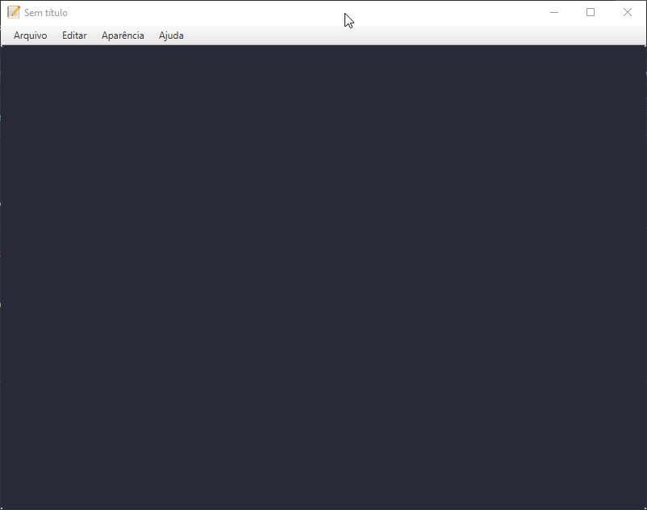

# Editor de texto com JavaFX
Editor de texto desenvolvido utilizando JavaFX

  

Assista aos vídeos!

### 01 -  Desenhando a Interface e Criando o Primeiro Arquivo

### 02 - Criando e Alterando Arquivos

### 03 - Funcionalidades Copiar, Colar, Novo Arquivo e Zoom

### 04 - Funcionalidades Modo Claro/Escuro, Menu de Contexto e Atalhos

 
Canal no Youtube 

